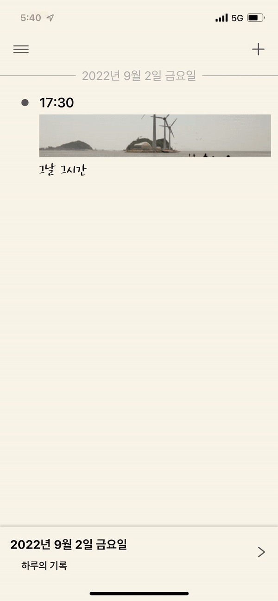
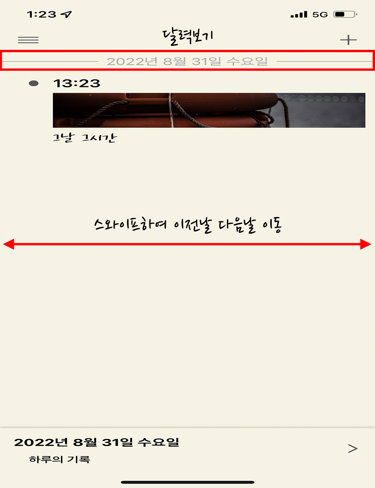
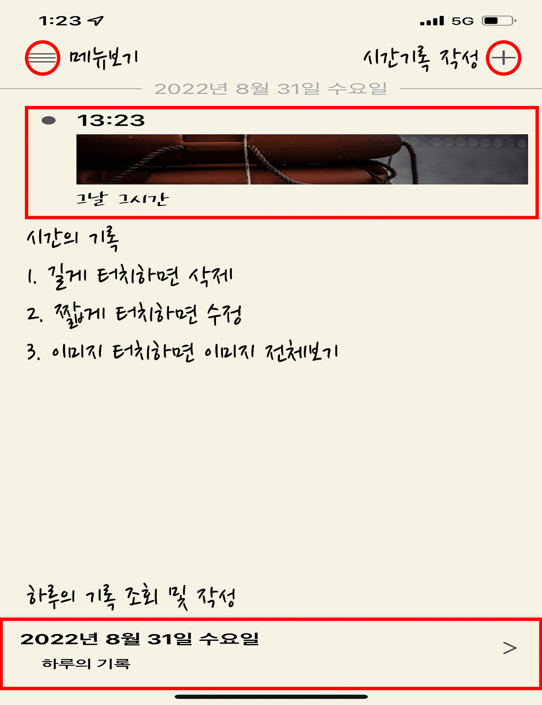
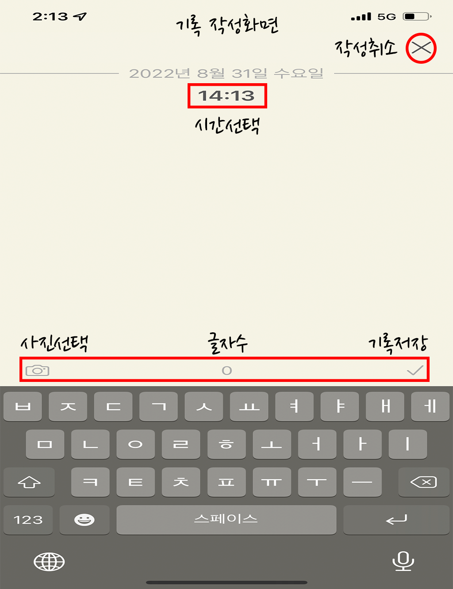
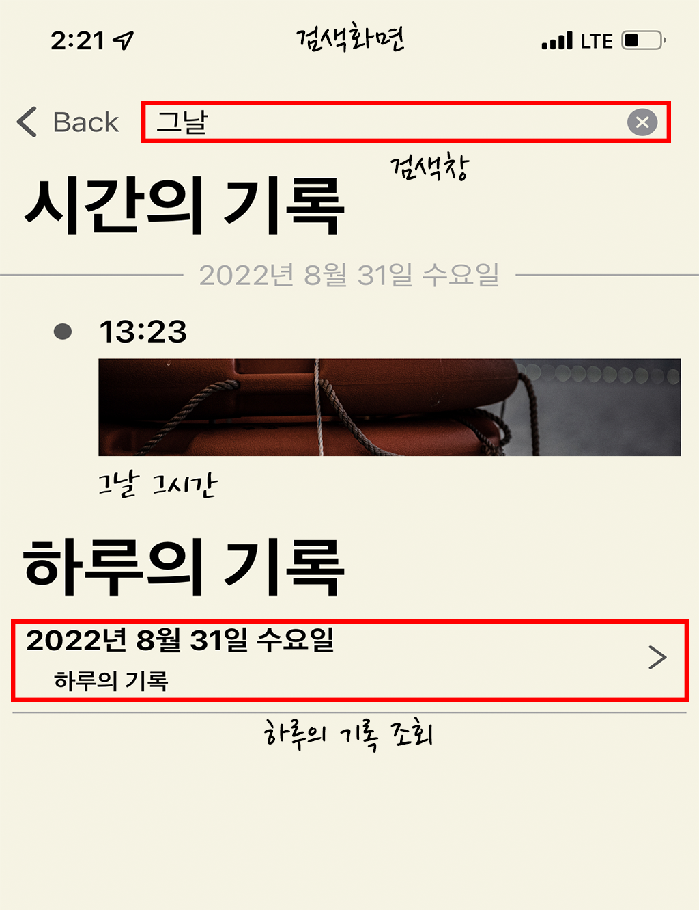
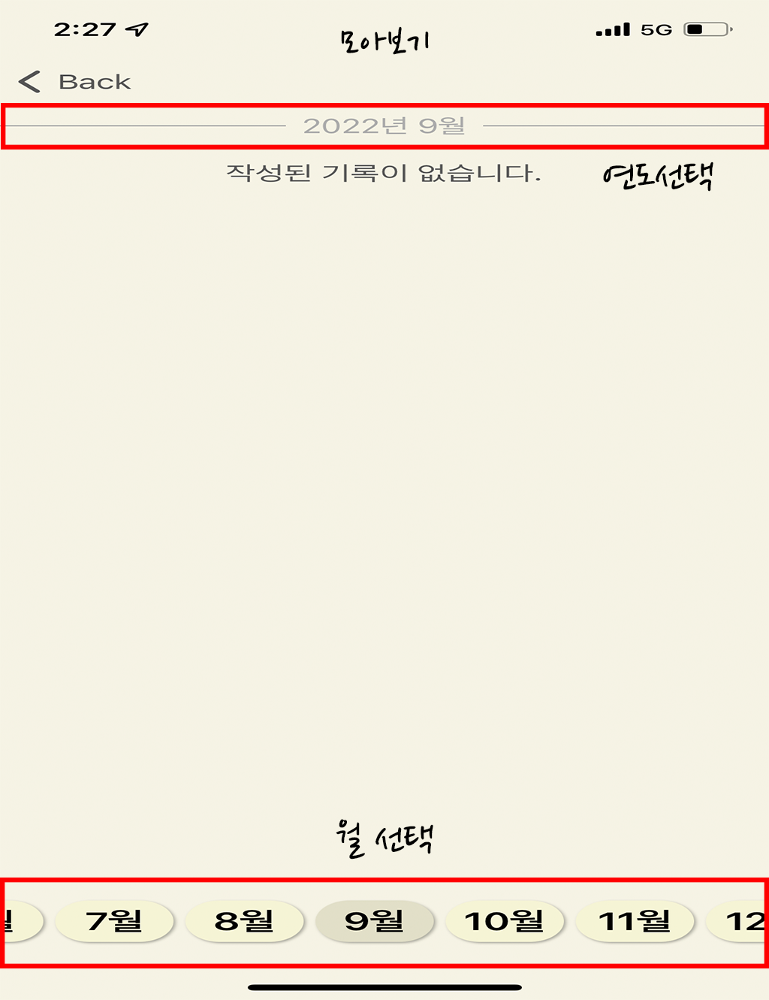

# 그날 그시간 - 시간의 기록

## 팀원소개
| JMin | 
| -- | 
| |

 

## 프로젝트 소개

 

### 그날 그시간 - 시간의 기록
- 시간단위로 하는 기록
- 하루단위로 하는 기록
- 작성한 기록 검색
- 작성한 기록 월별로 모아보기
- iCloud 백업/복구
- 잠금모드 및 생체인식 잠금
- 기록을 까먹지 않도록 알림
- 다양한 글씨체

 

## 버전
- v1.0
  - 기본 기능

 

## 개발 기간
- v1.0 - 2022.08.07 ~ 2022.08.30 (23일)

 

## 사용 기술
- `UIKit`, `NoStoryboard`, `MVVM`, `Combine`, `CoreData`, `CloudKit`, `UserDefaults`, `LocalAuthentication`, `UICollectionViewCompositionalLayout`, `UserNotifications`

 

## 사용 외부 라이브러리
- `SnapKit`, `Toast`, `SideMenu`, `CombineCocoa`

 

## 실횅화면

| 
 작성 
 | 
 검색 
 | 
 모아보기 
 |
| -- | -- | -- |
| 
  
 | 
  
 | 
  
 | 

 

## 앱 사용법
| 
 홈화면 1 
 | 
 홈화면 2 
 |
| -- | -- |
| 
  
 | 
  
 |

| 
 작성화면 
 | 
 검색화면 
 | 
 모아보기화면 
 |
| -- | -- | -- |
| 
  
 | 
  
 | 
  
 |
